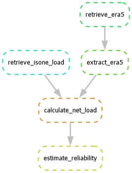

# Offshore Wind Analysis (ISO-NE)
The analysis in this repository assesses the potential contribution of offshore
wind to reducing the risk of power outages in New England, particularly in
winter, based on a key reliability metric. It builds on work by the Union of
Concerned Scientists, including New England’s Offshore Wind Solution 
([February 2026](https://www.ucs.org/resources/new-englands-offshore-wind-solution)).

The analysis involves
* Calculating daily electricity demand in the region by pulling and summing
  hourly data from ISO-NE, the regional electric grid operator
* Calculating daily offshore wind energy potential by pulling indicative hourly
  wind speed data from the Copernicus Climate Change Service’s ERA5, converting
  those data to hourly capacity factors using turbine information from the
  National Laboratory of the Rockies, calculating theoretical generation from
  defined levels of offshore wind (OSW) turbine capacity, and summing that
  generation
* Calculating daily electricity demand net of OSW electricity

The results show the extent to which OSW could have reduced the risk of an
energy shortfall during periods of elevated demand-driven blackout risk (which
ISO-NE defines as daily energy demand above 350,000 megawatt-hours) and higher
blackout risk (when demand was above 400,000 MWh).

## Snakemake & DAG

The updated version of the analysis uses the Snakemake workflow management tool
execute the calculations summarized above. Below is the directed acyclic graph
(DAG) for the reliability portion of the workflow.



## Reproduce the Results

> [!IMPORTANT]
> This analysis draws from a couple of different API sources that require account set up.
> Users must have an account with [ISONE](https://www.iso-ne.com/isoexpress/login?p_p_id=com_liferay_login_web_portlet_LoginPortlet&p_p_lifecycle=0&p_p_state=maximized&p_p_mode=view&_com_liferay_login_web_portlet_LoginPortlet_mvcRenderCommandName=%2Flogin%2Fcreate_account&saveLastPath=false)
> and an account with [Copernicus](https://cds.climate.copernicus.eu/how-to-api).

### Set Up

1. Clone the repository
```bash
git clone https://www.github.com/ucsusa/osw_analysis.git
```

2. Copy or rename the `.env.template` file to a new file called `.env` in the same directory.
3. Fill in the required data (ISONE Username/Password) in the `.env` file.
4. Follow the set up instructions for [CDSAPI](https://cds.climate.copernicus.eu/how-to-api) (including creating a `.cdsapirc` 
file.)
5. Set up the `conda` environment
```bash
conda env create -f environment.yml
conda activate osw
```

### Execute the Analysis
The analysis may be reproduced using either of the following commands
after navigating to the `workflow` directory.

```bash
snakemake -j1
# or
snakemake estimate_reliability -j1
```